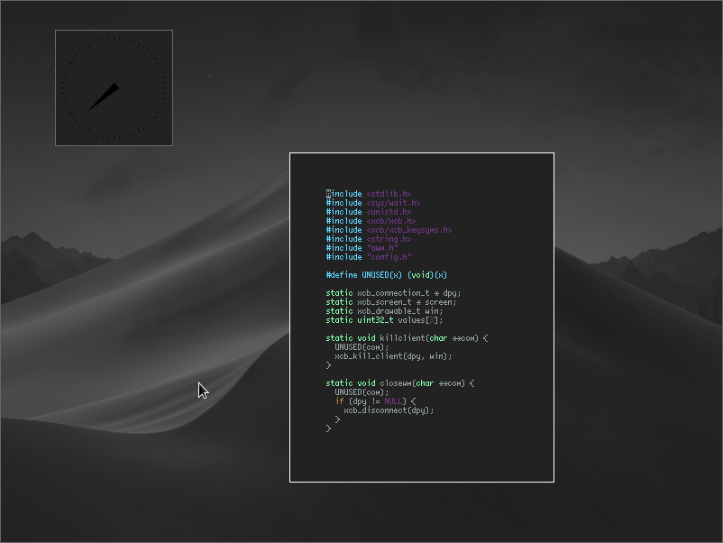
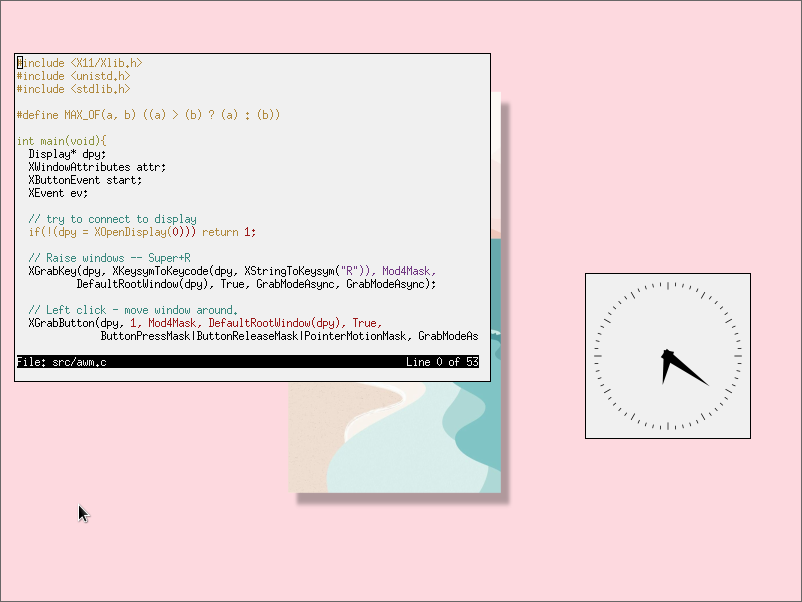

# awm (Abxxbo's Window Manager)

<div align="center">
    <a href="img/scrot1.png"></a><a href="img/scrot2.png"></a>
</div>

<br>

## Features

- Floating only
- Virtual workspaces
- Titlebars
- Modular config system

## Default Keybinds

**Window Management**

| keybind       | action        |
| ------------- | ------------- |
| `Mouse`       | focus         |
| `Mod4+R`      | raise window  |
| `Mod4+F`      | fullscreen    |
| `Mod4+Q`      | kill window   |
| `Mod4+Mouse1` | move window   |
| `Mod4+Mouse3` | resize window |

**Programs**

| keybind       | program       |
| ------------- | ------------- |
| `Mod4+Return` | `urxvt`       |
| `Mod4+Space`  | `rofi`        |

## Dependencies
- xcb

## Installation

<a href="https://repology.org/badge/vertical-allrepos/awm.svg"></img></a>

If you are on arch linux, you can install awm through the AUR as [awm-git](https://aur.archlinux.org/packages/awm-git).

If you are not running arch, first check if awm is in the repositories. If it isn't, use this to install awm:
```sh
# Create the autostart file, you don't need to put anything in it.
# Sadly, as of right now, awm will crash if no autostart file is detected.
$ touch ~/.config/awm/autostart
# Modify the confifg file to your liking. You can find it in include/config.h
$ $EDITOR include/config.h
# Once you're done, you can compile the code and install.
$ make
$ sudo make install
```

### On startup when you are logging in

If you are using `~/.xinitrc` to start your X session, you need to add `exec awm` to it.

If you are using a display manager, create a file named `/usr/share/xsessions/awm.desktop` and save the following into it:
```
[Desktop Entry]
Name=awm
Comment=This session runs awm as desktop manager
Exec=awm
Type=Application
```
