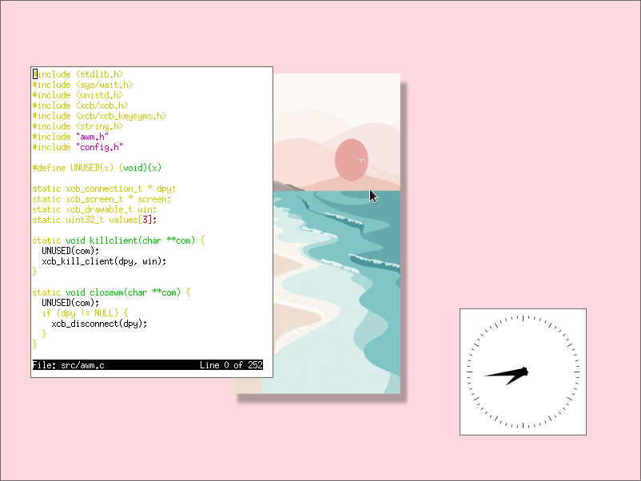

# awm (Abxxbo's Window Manager)

<div align="center">
    <a href="img/scrot1.png"></a><a href="img/scrot2.png"></a>
</div>

<br>

## Features

- Floating only
- No ICCCM
- No full implementation of EWMH
- No window borders

## Default Keybinds

**Window Management**

| keybind       | action        |
| ------------- | ------------- |
| `Mouse`       | focus         |
| `Mod4+R`      | raise window  |
| `Mod4+Q`      | kill window   |
| `Mod4+Mouse1` | move window   |
| `Mod4+Mouse3` | resize window |

**Programs**

| keybind       | program       |
| ------------- | ------------- |
| `Mod4+Return` | `urxvt`       |
| `Mod4+Space`  | `rofi`        |

## Dependencies
- `xlib`

## Installation
1. copy `sxhkdrc` to `~/.config/awm/sxhkdrc`
2. Create a autostart file, `~/.config/awm/autostart`
3. Build awm: `make`
4. Install via `sudo make install`
5. Add awm to `~/.xinitrc`:
```sh
exec awm
```

## Inspired by
- [sowm](https://github.com/dylanaraps/sowm)
- [tinywm](http://incise.org/tinywm.html)
